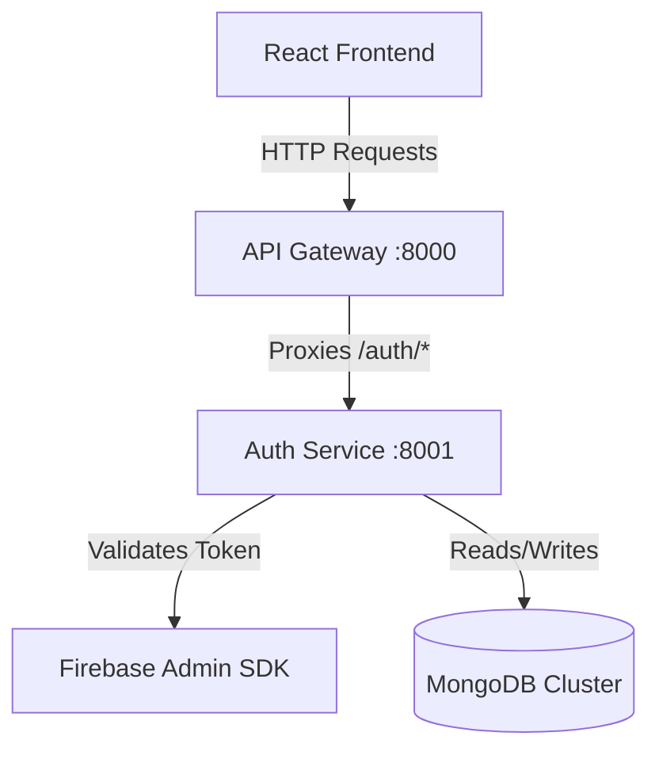
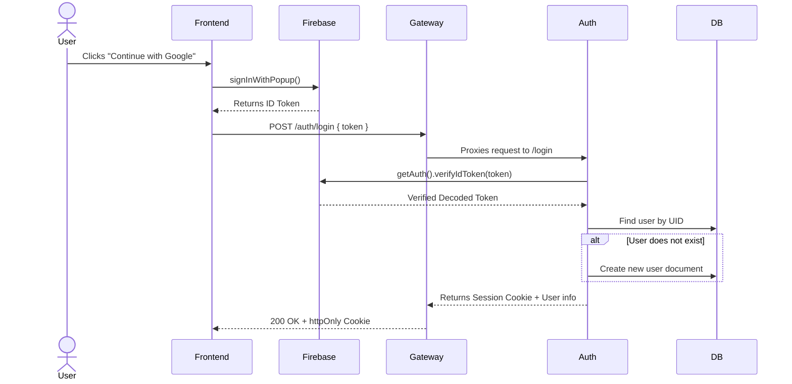

# 🤖 MultiAgentX — AI-Powered Multi-Agent Collaboration Platform

<div align="center">

[](https://github.com/RajChaudhary7706/MultiAgentX/stargazers)
[](https://github.com/RajChaudhary7706/MultiAgentX/network/members)
[](https://github.com/RajChaudhary7706/MultiAgentX/issues)
[](https://github.com/RajChaudhary7706/MultiAgentX/commits/main)
[](https://github.com/RajChaudhary7706/MultiAgentX)
[](LICENSE)

**MultiAgentX** is a next-generation microservices-based platform designed for automated task planning, collaboration, and orchestration across specialized autonomous AI agents. Built with robustness, security, and scalability in mind.

[Explore Docs](#-architecture) • [Report Bug](https://github.com/RajChaudhary7706/MultiAgentX/issues) • [Request Feature](https://github.com/RajChaudhary7706/MultiAgentX/issues)

</div>

---

## 📖 Table of Contents

- [🤖 Project Title & Description](#-multiagentx--ai-powered-multi-agent-collaboration-platform)
- [✨ Features](#-features)
- [🛠️ Tech Stack](#️-tech-stack)
- [🏗️ Architecture](#️-architecture)
- [📁 Project Structure](#-project-structure)
- [🚀 Installation Guide](#-installation-guide)
- [🔐 Environment Variables](#-environment-variables)
- [🔌 API Documentation](#-api-documentation)
- [🔄 Authentication Flow](#-authentication-flow)
- [🗄️ Database Design](#️-database-design)
- [📝 Logging System](#-logging-system)
- [🚨 Error Handling](#-error-handling)
- [🛡️ Security Features](#️-security-features)
- [📸 Screenshots](#-screenshots)
- [🚢 Deployment](#-deployment)
- [🎯 Future Improvements](#-future-improvements)
- [🤝 Contributing Guide](#-contributing-guide)
- [📄 License](#-license)
- [👤 Author & Acknowledgements](#-author)
- [🛠️ Troubleshooting & FAQ](#️-troubleshooting)

---

## ✨ Features

- **Microservice Architecture**: Decoupled gateway and services communicate securely, enabling modular agent additions.
- **Unified API Gateway**: Routes external client traffic to specific backend microservices using Express reverse proxy.
- **Secure Authentication**: Integrated with Google Firebase Sign-In on the client side and validated on the backend.
- **Robust Database Access**: Mongoose models handle persistent storage with structural validation.
- **Secure Cookie Management**: Server issues stateful, HTTP-Only session IDs for session persistence and protection against XSS.
- **Tailwind CSS v4 Integration**: Ultra-fast compiling, utility-first styling for a sleek, responsive UI.

---

## 🛠️ Tech Stack

### 💻 Frontend
- **Framework**: React 19 (Vite)
- **Styling**: Tailwind CSS v4
- **HTTP Client**: Axios (configured with credentials)
- **Auth Provider**: Firebase Client SDK

### ⚙️ Backend
- **Runtime**: Node.js
- **Server Framework**: Express.js
- **API Proxy**: Express HTTP Proxy
- **ORM/ODM**: Mongoose

### 🗄️ Database
- **Primary Database**: MongoDB Atlas (Cloud) / Local MongoDB Server

### 🔑 Authentication
- **Identity Provider**: Google Firebase Admin SDK

### 🚢 Cloud Services & Tools
- **Reverse Proxy**: Gateway Routing
- **Containerization**: Docker & Docker Compose
- **Hosting Platforms**: Vercel (Frontend), Render (Backend services)

---

## 🏗️ Architecture



### Component Breakdown
1. **Frontend**: Operates on client-side React. Manages login popups, retrieves Google ID Tokens, and handles UI rendering.
2. **API Gateway (`:8000`)**: Single entry point. Sanitizes incoming cookies, handles CORS, and forwards routes to target microservices.
3. **Auth Service (`:8001`)**: Interacts with the database, validates incoming Firebase tokens, issues session IDs, and manages user schemas.

---

## 📁 Project Structure

```text
MultiAgentX
├── backend
│   ├── gateway
│   │   ├── index.js            # Gateway entry & route configuration
│   │   ├── package.json        # Gateway dependencies (express-http-proxy)
│   │   └── .env                # Gateway environment variables
│   ├── services
│   │   ├── auth
│   │   │   ├── config
│   │   │   │   ├── db.js       # MongoDB Mongoose connection handler
│   │   │   │   └── firebase.js # Firebase Admin SDK configuration
│   │   │   ├── controllers
│   │   │   │   └── auth.controller.js # Verification & login handler
│   │   │   ├── models
│   │   │   │   └── user.model.js      # Mongoose User Schema
│   │   │   ├── routes
│   │   │   │   └── auth.router.js     # Express routes mapped to auth
│   │   │   ├── index.js        # Auth Service entry port listener
│   │   │   ├── package.json    # Auth microservice dependency definitions
│   │   │   ├── serviceAccountKey.json # Firebase service credentials (Git-ignored)
│   │   │   └── .env            # Auth Service configuration parameters
│   └── shared                  # Shared helper functions/constants
├── frontend
│   ├── public                  # Public static assets
│   ├── src
│   │   ├── assets              # Graphic files and logos
│   │   ├── App.jsx             # React Application root component
│   │   ├── index.css           # Global CSS and Tailwind CSS setup
│   │   └── main.jsx            # DOM renderer hook
│   ├── utils
│   │   ├── axios.js            # Axios client instance configuration
│   │   └── firebase.js         # Firebase App configuration credentials
│   ├── .env                    # Frontend environment parameters
│   ├── index.html              # Main HTML skeleton
│   ├── package.json            # React & styling dependencies
│   └── vite.config.js          # Vite build parameters
└── README.md
```

---

## 🚀 Installation Guide

### 📦 Prerequisites
- **Node.js** v18.0 or higher
- **NPM** v9.0 or higher
- **MongoDB** running locally or a **MongoDB Atlas Cloud URI**
- A **Firebase Project** with Google Authentication enabled

---

### 🛠️ Step-by-Step Setup

#### 1. Clone Repository
```bash
git clone https://github.com/RajChaudhary7706/MultiAgentX.git
cd MultiAgentX
```

#### 2. Install Dependencies
Install modules for the gateway, auth service, and frontend:
```bash
# Gateway
cd backend/gateway
npm install

# Auth Service
cd ../services/auth
npm install

# Frontend
cd ../../../frontend
npm install
```

#### 3. Configure Credentials & Environment
* Create a Firebase Project on the [Firebase Console](https://console.firebase.google.com/).
* Retrieve your Web App config credentials and generate a new **Firebase Admin Private Key (JSON)**.
* Save the JSON credential file as `backend/services/auth/serviceAccountKey.json`.
* Configure all environment files as outlined in the [Environment Variables](#-environment-variables) section.

#### 4. Run the Stack (Development)

**Terminal 1: Start API Gateway**
```bash
cd backend/gateway
npm run dev
```

**Terminal 2: Start Auth Service**
```bash
cd backend/services/auth
npm run dev
```

**Terminal 3: Start Frontend Client**
```bash
cd frontend
npm run dev
```

The application will now be running at `http://localhost:5173`.

---

## 🔐 Environment Variables

Ensure you create `.env` files in each service directory with the configurations below.

<details>
<summary>🔑 Click to view Backend Gateway Environment File (.env)</summary>

Save to [backend/gateway/.env](file:///c:/Projects/MultiAgentX/backend/gateway/.env):
```env
PORT=8000
AUTH_SERVICE_URL="http://localhost:8001"
FRONTEND_URL="http://localhost:5173"
```
* `PORT`: Port where the Gateway listens.
* `AUTH_SERVICE_URL`: Downstream URL for the Auth Service.
* `FRONTEND_URL`: URL of the React client (used for CORS headers configuration).

</details>

<details>
<summary>🔑 Click to view Backend Auth Service Environment File (.env)</summary>

Save to [backend/services/auth/.env](file:///c:/Projects/MultiAgentX/backend/services/auth/.env):
```env
PORT=8001
MONGODB_URL="mongodb+srv://<username>:<password>@<cluster>.mongodb.net/multiagentx?retryWrites=true&w=majority"
```
* `PORT`: Port where the Auth Service listens.
* `MONGODB_URL`: MongoDB Connection URI containing credentials.

</details>

<details>
<summary>🔑 Click to view Frontend Environment File (.env)</summary>

Save to [frontend/.env](file:///c:/Projects/MultiAgentX/frontend/.env):
```env
VITE_FIREBASE_API_KEY="AIzaSy..."
VITE_SERVER_URL="http://localhost:8000"
```
* `VITE_FIREBASE_API_KEY`: Client key for authentication popup validation.
* `VITE_SERVER_URL`: Base API endpoint pointing to the Gateway server.

</details>

---

## 🔌 API Documentation

All API traffic should pass through the API Gateway (`:8000`).

| HTTP Method | Gateway Endpoint | Service Routed | Description | Auth Required? |
| :--- | :--- | :--- | :--- | :--- |
| **GET** | `/` | Gateway | Handshake message confirming API gateway status. | No |
| **GET** | `/auth` | Auth Service | Handshake confirming Auth Service is online. | No |
| **POST** | `/auth/login` | Auth Service | Verifies a Google login ID Token, registers user, and sets session ID. | Yes (Token payload) |

---

## 🔄 Authentication Flow



1. **Client Popup**: React app launches Google OAuth dialog.
2. **Token Fetch**: Retreives JWT token from Google validation.
3. **Verification**: Backend Auth Service validates signature via Firebase Admin SDK.
4. **Mongoose Creation**: Saves name, email, avatar, and unique Firebase UID.
5. **Secure Cookie Session**: Issues stateful cookie `session` flags set to `httpOnly` for protection.

---

## 🗄️ Database Design

We use Mongoose schemas to represent users. Since we are using MongoDB, schemas are flexible but structured for safety.

### Collection: `users`
```javascript
{
  firebaseUid: { type: String, unique: true },
  name: { type: String },
  email: { type: String },
  avatar: { type: String },
  createdAt: { type: Date },
  updatedAt: { type: Date }
}
```

---

## 📝 Logging System

For production deployments, the system is designed to integrate **Winston logger** to handle output streams.

<details>
<summary>🔎 Click to view the logging strategy and configuration</summary>

### Features
1. **Levels**: Standard npm log levels (`error`, `warn`, `info`, `http`, `debug`).
2. **Correlation IDs**: Generates custom request IDs for tracing asynchronous operations across API gateway proxy hops.
3. **File Output**:
   - `logs/error.log` (Error messages only)
   - `logs/combined.log` (All standard outputs)

```javascript
import winston from 'winston';

const logger = winston.createLogger({
  level: 'info',
  format: winston.format.combine(
    winston.format.timestamp(),
    winston.format.json()
  ),
  transports: [
    new winston.transports.File({ filename: 'logs/error.log', level: 'error' }),
    new winston.transports.File({ filename: 'logs/combined.log' }),
  ],
});
```

</details>

---

## 🚨 Error Handling

The application handles downstream and connection errors gracefully:
- **Centralized Middleware**: Handles route crashes and returns standard JSON messages rather than leaking runtime traces to clients.
- **Express try/catch wrapper**: Async routes are caught securely inside the controllers.

---

## 🛡️ Security Features

- **CORS Protection**: Access to backend routes restricted only to designated `FRONTEND_URL`.
- **HTTP-Only Cookies**: Prevents client-side scripts from reading session tokens.
- **Firebase Token Verification**: No raw IDs accepted; all requests verified using Firebase signature check.
- **Validation**: Schema-level mongoose validation ensures malicious injections are filtered out.

---

## 📸 Screenshots

| Feature | Screenshot |
| :--- | :--- |
| **Authentication UI** | *[Placeholder: Add UI Landing Image Here]* |
| **Database Collections** | *[Placeholder: Add MongoDB Compass Database Collections View Here]* |

---

## 🚢 Deployment

### 🐳 Deploying with Docker Compose
We recommend using Docker Compose to orchestrate services in production:

```yaml
version: '3.8'
services:
  gateway:
    build: ./backend/gateway
    ports:
      - "8000:8000"
    environment:
      - PORT=8000
      - AUTH_SERVICE_URL=http://auth:8001
      - FRONTEND_URL=https://your-frontend.vercel.app

  auth:
    build: ./backend/services/auth
    ports:
      - "8001:8001"
    environment:
      - PORT=8001
      - MONGODB_URL=mongodb+srv://...
```

Run in the main folder:
```bash
docker-compose up --build -d
```

### ☁️ Cloud Deployments
* **Frontend**: Deploy directly to **Vercel** pointing to the gateway URL.
* **Backend Services**: Deploy separate services to **Render** or **Railway**.

---

## 🎯 Future Improvements

- [ ] Add Orchestrator microservice for task coordination.
- [ ] Add Chat Agent with LLM (Ollama / Gemini) integration.
- [ ] Add websocket layer to push agent logs to frontend in real time.
- [ ] Enable rate-limiting middleware (`express-rate-limit`) on Gateway.

---

## 🤝 Contributing Guide

1. **Fork** the project.
2. **Create a branch** (`git checkout -b feature/NewFeature`).
3. **Commit changes** (`git commit -m 'Add NewFeature'`).
4. **Push branch** (`git push origin feature/NewFeature`).
5. **Open a Pull Request**.

---

## 📄 License
Distributed under the **MIT License**. See `LICENSE` for more information.

---

## 👤 Author
- **Raj Chaudhary** - [GitHub Profile](https://github.com/RajChaudhary7706)

---

## 🛠️ Troubleshooting

#### 🛑 Error: `MongoServerError: bad auth : authentication failed`
- **Solution**: The MongoDB URL is incorrect or lacks permissions. Make sure to paste your full MongoDB Atlas connection string into `backend/services/auth/.env` and replace `YOUR_ATLAS_PASSWORD` with your actual database user password.

#### 🛑 Express Gateway is giving CORS errors
- **Solution**: Ensure the `FRONTEND_URL` variable in your gateway `.env` matches the exact URL running your frontend client (e.g. `http://localhost:5173` without trailing slashes).