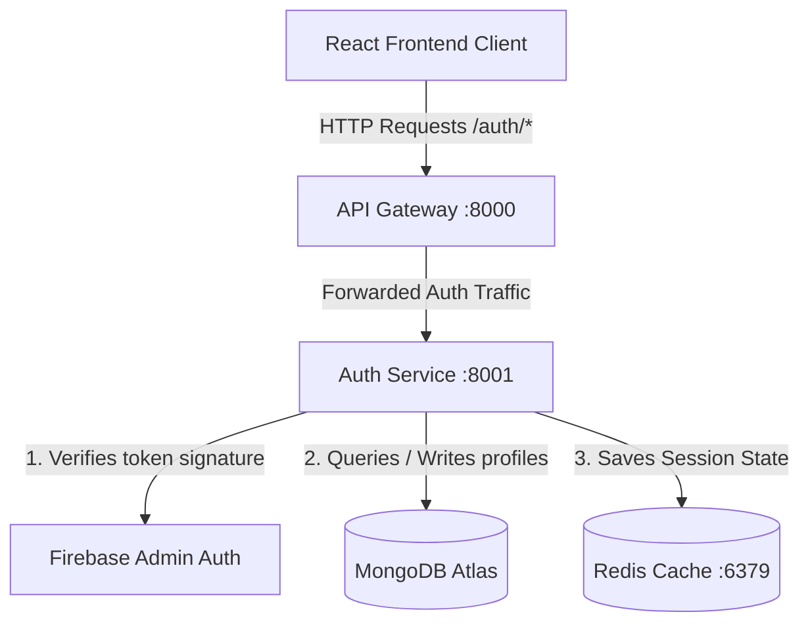
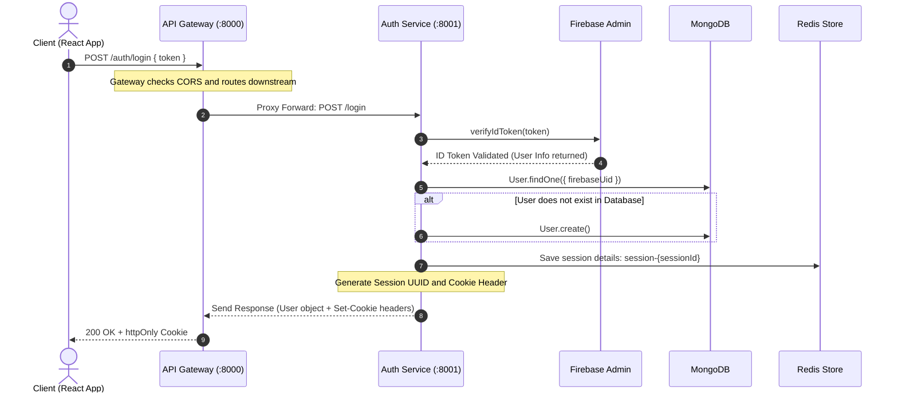

# 🤖 MultiAgentX — AI-Powered Multi-Agent Collaboration Platform

<div align="center">

[](https://github.com/RajChaudhary7706/MultiAgentX/stargazers)
[](https://github.com/RajChaudhary7706/MultiAgentX/network/members)
[](https://github.com/RajChaudhary7706/MultiAgentX/issues)
[](https://github.com/RajChaudhary7706/MultiAgentX/commits/main)
[](https://github.com/RajChaudhary7706/MultiAgentX)
[](LICENSE)

**MultiAgentX** is a next-generation microservices-based platform designed for automated task planning, collaboration, and orchestration across specialized autonomous AI agents. Built with robustness, security, and scalability in mind.

[Explore Docs](#-architecture) • [Report Bug](https://github.com/RajChaudhary7706/MultiAgentX/issues) • [Request Feature](https://github.com/RajChaudhary7706/MultiAgentX/issues)

</div>

---

## 📖 Table of Contents

- [🤖 Project Title & Description](#-multiagentx--ai-powered-multi-agent-collaboration-platform)
- [📖 Overview](#-overview)
- [✨ Features](#-features)
- [🛠️ Tech Stack](#️-tech-stack)
- [🏗️ Architecture](#️-architecture)
- [📁 Folder Structure](#-folder-structure)
- [🚀 Installation & Setup](#-installation--setup)
- [🔐 Environment Variables](#-environment-variables)
- [🔌 API Endpoints](#-api-endpoints)
- [🗄️ Database Design](#️-database-design)
- [🔄 Project Request Workflow](#-project-request-workflow)
- [📝 Logging Strategy](#-logging-strategy)
- [🚀 Docker & Redis Orchestration](#-docker--redis-orchestration)
- [🛡️ Security Best Practices](#️-security-best-practices)
- [📸 Screenshots](#-screenshots)
- [🚢 Deployment](#-deployment)
- [🎯 Future Improvements](#-future-improvements)
- [🤝 Contributing](#-contributing)
- [📄 License](#-license)
- [👤 Author](#-author)
- [🛠️ Troubleshooting & FAQ](#️-troubleshooting--faq)

---

## 📖 Overview

MultiAgentX is a secure, distributed multi-agent system built on a microservices architecture. It aims to solve the complexity of multi-agent execution, orchestration, and communication by decoupling operations into modular, independent services connected through a unified API Gateway.

### Key Objectives
* **Modular Agent Deployment**: Allow developers to plug in new specialized AI agents as standalone microservices.
* **Unified API Entrypoint**: Simplify client communication by proxying requests through a centralized gateway.
* **Secure Token Validation**: Authenticate all operations using Google Firebase on the client side and verify them on the backend via the Firebase Admin SDK.
* **High Performance Session Caching**: Offload session data state management to a fast, temporary Redis key-value memory store.

---

## ✨ Features

### 🔐 Authentication
* **Google Firebase Auth**: Leverages Google Identity Provider for frontend login dialogs.
* **Secure Session Cookies**: Passes `httpOnly`, `sameSite="strict"` session cookies to clients to safeguard credentials against Cross-Site Scripting (XSS) attacks.

### 🗄️ Database
* **Mongoose Models**: Enforces strict typing, database validation constraints, and auto-generated timestamp logs (`createdAt`/`updatedAt`) for user profiles.

### 🔌 Unified Routing
* **Reverse Proxy Gateway**: Utilizes `express-http-proxy` to distribute route traffic downstream without exposing service ports directly to the internet.

### ⚡ Caching (Redis)
* **Session Persistence**: Stores serialized JSON user session data under an ephemeral cache with a configurable Time-To-Live (TTL) expiration window (7 days).

### 🐳 Containerization
* **Dockerized Infrastructure**: Includes a Docker Compose manifest to quickly bootstrap a localized Redis instance with port mappings.

---

## 🛠️ Tech Stack

### 💻 Frontend
* **Core Framework**: React 19 (Vite)
* **Styling**: Tailwind CSS v4 (ultra-fast utility-first compilation)
* **HTTP Client**: Axios (configured with CORS credentials support)
* **Authentication**: Firebase Client SDK

### ⚙️ Backend
* **Runtime Environment**: Node.js
* **Framework**: Express.js (v5.x)
* **Gateway Proxy**: Express HTTP Proxy
* **Caching Client**: ioredis

### 🗄️ Database
* **Database engine**: MongoDB Atlas (Cloud) / Local MongoDB Server
* **ORM/ODM Layer**: Mongoose

### 🔑 Credentials & Security
* **Identity Verification**: Google Firebase Admin SDK

### 🚢 Infrastructure & Dev Tools
* **Service Coordination**: Docker & Docker Compose
* **Process Watcher**: Nodemon

---

## 🏗️ Architecture

The platform separates the presentation, routing, and business logic into three distinct layers.



### Component Breakdown
1. **Frontend Client**: Manages login buttons, coordinates authentication state, and renders responsive Tailwind-styled views.
2. **API Gateway (`:8000`)**: The single entrypoint for frontend requests. Resolves CORS permissions, processes incoming cookies, and handles reverse proxying.
3. **Auth Service (`:8001`)**: Validates Firebase credentials, persists user profiles inside MongoDB, handles session generation/revocation, and communicates with Redis.

---

## 📁 Folder Structure

Below is the directory tree of the MultiAgentX project:

```text
MultiAgentX
├── backend
│   ├── docker-compose.yml      # Orchestrates local Redis service container
│   ├── gateway
│   │   ├── index.js            # Entry point for the Express API Gateway
│   │   ├── package.json        # Gateway routing dependencies
│   │   └── .env                # Gateway environmental configs
│   ├── services
│   │   └── auth
│   │       ├── config
│   │       │   ├── db.js       # Mongoose MongoDB connection script
│   │       │   └── firebase.js # Firebase Admin initialization cert wrapper
│   │       ├── controllers
│   │       │   └── auth.controller.js # Login, registration, and logout handlers
│   │       ├── models
│   │       │   └── user.model.js      # Mongoose schema mapping user attributes
│   │       ├── routes
│   │       │   └── auth.router.js     # Endpoint routes for authentication
│   │       ├── index.js        # Main microservice port listener
│   │       ├── package.json    # Auth microservice dependency manifest
│   │       └── .env            # Auth Service database keys
│   └── shared
│       └── redis
│           └── redis.js        # Shared ioredis connector instance
├── frontend
│   ├── public                  # Static folder assets
│   ├── src
│   │   ├── assets              # Images, vector graphics, and logos
│   │   ├── pages
│   │   │   └── Home.jsx        # Landing landing dashboard screen
│   │   ├── App.jsx             # Main router and component manager
│   │   ├── index.css           # Global stylesheet loading Tailwind directive
│   │   └── main.jsx            # Mounts React components to the root DOM hook
│   ├── utils
│   │   ├── axios.js            # Instantiated Axios wrapper with withCredentials
│   │   └── firebase.js         # Firebase client config initialization
│   ├── .env                    # Frontend connection configs
│   ├── index.html              # HTML DOM entry script
│   ├── package.json            # Vite, React, and styles manifest
│   └── vite.config.js          # Custom Vite compiler directives
└── README.md
```

---

## 🚀 Installation & Setup

### 📦 Prerequisites
* **Node.js** v18.0.0 or higher
* **NPM** v9.0.0 or higher
* **Docker Desktop** installed and running (for Redis)
* A **Firebase Project** configured with Google Authentication enabled

---

### 🛠️ Step-by-Step Installation

#### 1. Clone the Repository
```bash
git clone https://github.com/RajChaudhary7706/MultiAgentX.git
cd MultiAgentX
```

#### 2. Start the Redis Cache
Run the Docker Compose command inside the `backend` folder to spin up the local Redis container:
```bash
cd backend
docker-compose up -d
```

#### 3. Install Backend Dependencies
Install node modules for both the Gateway and the Auth Service:
```bash
# Install Gateway modules
cd gateway
npm install

# Install Auth Service modules
cd ../services/auth
npm install
```

#### 4. Setup Authentication Credentials
* Navigate to the **Firebase Console**.
* Go to **Project Settings** > **Service Accounts**.
* Click **Generate New Private Key**, saving the downloaded JSON file as `backend/services/auth/serviceAccountKey.json`.

#### 5. Install Frontend Dependencies
```bash
cd ../../../frontend
npm install
```

#### 6. Run the Application
Start the services in separate terminal windows:

**Terminal 1: Start API Gateway**
```bash
cd backend/gateway
npm run dev
```

**Terminal 2: Start Auth Service**
```bash
cd backend/services/auth
npm run dev
```

**Terminal 3: Start Frontend Client**
```bash
cd frontend
npm run dev
```

Your browser should open and display the React client running on the local port.

---

## 🔐 Environment Variables

Ensure you create `.env` files in each service directory with the configurations below.

<details>
<summary>🔑 Click to view Gateway Environment variables (.env)</summary>

Create file at `backend/gateway/.env`:
```env
PORT=8000
AUTH_SERVICE_URL="http://localhost:8001"
FRONTEND_URL="http://localhost:5173"
```
* `PORT`: Listening port for the Gateway server.
* `AUTH_SERVICE_URL`: Port routing path for the Auth Service.
* `FRONTEND_URL`: URL of the React client (used to bind CORS permissions).

</details>

<details>
<summary>🔑 Click to view Auth Service Environment variables (.env)</summary>

Create file at `backend/services/auth/.env`:
```env
PORT=8001
MONGODB_URL="mongodb+srv://<username>:<password>@cluster.mongodb.net/multiagentx"
REDIS_URL="redis://localhost:6379"
```
* `PORT`: Port where the Auth Service listens.
* `MONGODB_URL`: Remote Atlas connection endpoint.
* `REDIS_URL`: Connection string mapping local Redis socket.

</details>

<details>
<summary>🔑 Click to view Frontend Client Environment variables (.env)</summary>

Create file at `frontend/.env`:
```env
VITE_FIREBASE_API_KEY="AIzaSyYourApiKeyHere"
VITE_SERVER_URL="http://localhost:8000"
```
* `VITE_FIREBASE_API_KEY`: Client token key needed to initialize Firebase auth widgets.
* `VITE_SERVER_URL`: Base Axios configuration endpoint pointing to the API Gateway.

</details>

---

## 🔌 API Endpoints

All external HTTP traffic queries target the API Gateway (`:8000`).

| HTTP Method | Gateway Endpoint | Target Microservice | Description | Auth Required |
| :--- | :--- | :--- | :--- | :--- |
| **GET** | `/` | Gateway | Verifies gateway server status. | No |
| **GET** | `/auth` | Auth Service | Verifies authentication microservice status. | No |
| **POST** | `/auth/login` | Auth Service | Verifies Google ID Token, logs/registers user, and issues a session cookie. | Yes (Firebase token) |
| **POST** | `/auth/logout` | Auth Service | Clears cookie session headers and removes user state from Redis store. | Yes (Cookie session ID) |

---

## 🗄️ Database Design

We use MongoDB and Mongoose structures to manage user identities.

### Schema: `User`
```javascript
{
  firebaseUid: { type: String, unique: true }, // Verified UID from Google
  name: { type: String },                      // User display name
  email: { type: String },                     // User registration email
  avatar: { type: String },                    // Profile photo URL
  createdAt: { type: Date },                   // Managed automatically by timestamps:true
  updatedAt: { type: Date }                    // Managed automatically by timestamps:true
}
```

---

## 🔄 Project Request Workflow

Here is how a standard login request flows through the MultiAgentX backend:



1. **Client Action**: Client logs in with popup, receives token from Firebase, and sends a `POST` request to `/auth/login`.
2. **Gateway Route**: Gateway receives request on Port `8000` and proxies it to Auth Service on Port `8001`.
3. **Controller Handling**: The Auth Router hits `login()` controller in `auth.controller.js`.
4. **Credential Check**: Controller verifies the signature using the Firebase Admin configuration.
5. **Persistence**: Controller searches MongoDB; if user is new, it persists the user data.
6. **State Creation**: Generates a session ID, saves serialized user metadata in Redis with a 7-day expiration, and generates cookie headers.
7. **Response Distribution**: Returns the user data and appends `Set-Cookie` header to establish stateful connection.

---

## 📝 Logging Strategy

* **Morgan HTTP Middleware**: Log traffic output from routes is output locally within console headers (installed on API Gateway).
* **[TODO / Production Plan]**: Integrate **Winston Logger** to output service-level error buffers directly into persistent files (`logs/error.log` and `logs/combined.log`).
* **[TODO / Production Plan]**: Generate and append correlation UUID keys on the gateway to track transactions across multiple services.

---

## 🚀 Docker & Redis Orchestration

Redis is orchestrated using Docker Compose to ensure a predictable environment.

```yaml
services:
  redis:
    image: redis
    ports:
      - "6379:6379"
```

To run Docker in background:
```bash
docker-compose up -d
```
To check status of the container:
```bash
docker ps
```
To tear down the service:
```bash
docker-compose down
```

---

## 🛡️ Security Best Practices

* **HTTP-Only Cookies**: Prevents client-side scripts (XSS attacks) from reading user sessions.
* **CORS Restriction**: Sets gateway endpoints to accept requests exclusively from the designated client host `FRONTEND_URL`.
* **State Verification**: Restricts unauthorized backend actions by requiring valid Firebase authentication credentials.
* **Strict Cookies**: Sets cookies to use `sameSite="strict"` rules to guard against Cross-Site Request Forgery (CSRF).

---

## 📸 Screenshots

| View Description | Visual Mockup / Interface |
| :--- | :--- |
| **Authentication Screen** | `[Placeholder: Add UI Landing Image Here]` |
| **Active MongoDB Databases** | `[Placeholder: Add MongoDB Compass Database Collections View Here]` |
| **Redis Sessions** | `[Placeholder: Add Redis Desktop Manager Active Session Keys View Here]` |

---

## 🚢 Deployment

### 1. Frontend
The frontend React project is ready for quick deployment on **Vercel**:
* Connect the repository to Vercel.
* Configure `VITE_SERVER_URL` pointing to your hosted API Gateway endpoint.

### 2. Backend Gateway & Microservices
The backend node microservices are ready to run on platforms like **Render**, **Railway**, or AWS EC2:
* Configure your env settings mapping private keys and connection URLs.
* Ensure your Redis endpoint is correctly configured in your Auth service environment variable `REDIS_URL`.

---

## 🎯 Future Improvements

- [ ] Add Orchestrator microservice for task coordination.
- [ ] Add Chat Agent with LLM (Ollama / Gemini) integration.
- [ ] Add websocket layer to push agent logs to frontend in real time.
- [ ] Implement Winston production logger and Correlation IDs.
- [ ] Enable rate-limiting middleware (`express-rate-limit`) on Gateway.

---

## 🤝 Contributing

Contributions are what make the open source community such an amazing place to learn, inspire, and create.

1. Fork the Project.
2. Create your Feature Branch (`git checkout -b feature/AmazingFeature`).
3. Commit your Changes (`git commit -m 'Add some AmazingFeature'`).
4. Push to the Branch (`git push origin feature/AmazingFeature`).
5. Open a Pull Request.

---

## 📄 License

Distributed under the **MIT License**. See `LICENSE` for more information.

---

## 👤 Author

* **Raj Chaudhary**
  * GitHub: [@RajChaudhary7706](https://github.com/RajChaudhary7706)
  * Email: rcexpress7706@gmail.com

---

## 🛠️ Troubleshooting & FAQ

#### Q1: React client displays a blank screen or a developer console error about Home component not found
* **Solution**: Ensure your imports in [src/App.jsx](file:///c:/Projects/MultiAgentX/frontend/src/App.jsx) are resolved. Check that you have imported the Home component correctly from `./pages/Home` and that there are no duplicate default exports inside [src/pages/Home.jsx](file:///c:/Projects/MultiAgentX/frontend/src/pages/Home.jsx).

#### Q2: Express API Gateway throws CORS policy errors when making requests
* **Solution**: Verify that `FRONTEND_URL` in [backend/gateway/.env](file:///c:/Projects/MultiAgentX/backend/gateway/.env) exactly matches the URL of your React frontend application, and does not have a trailing slash.

#### Q3: Database connection fails on the Auth Service
* **Solution**: Check that the MongoDB connection string in [backend/services/auth/.env](file:///c:/Projects/MultiAgentX/backend/services/auth/.env) is correct. Ensure your database IP whitelist permissions in MongoDB Atlas allow access from your current network.

#### Q4: Axios requests fail with Network Error
* **Solution**: Ensure all backend microservices are up and running, and the API Gateway is online on port 8000.